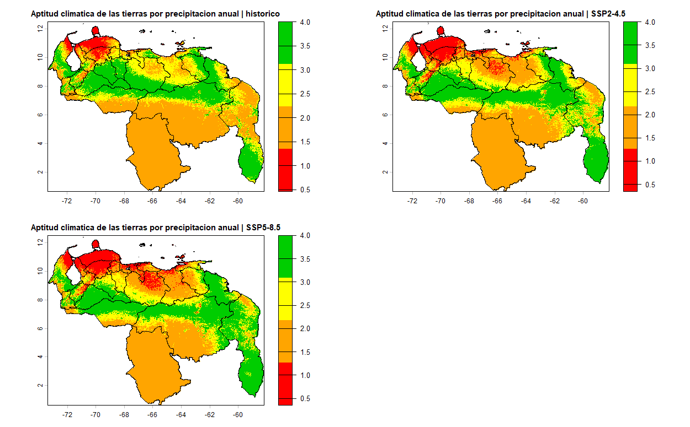
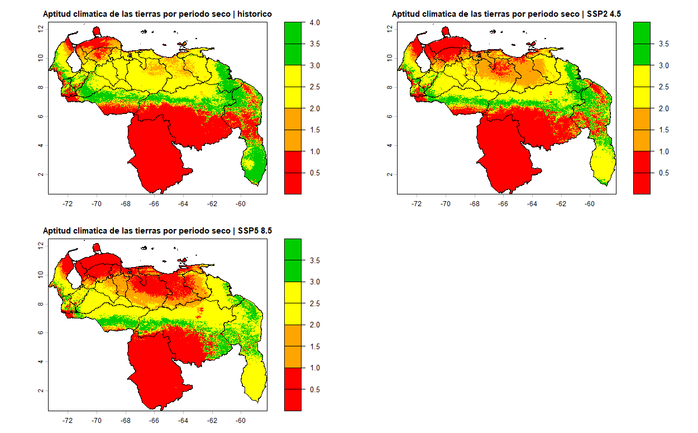
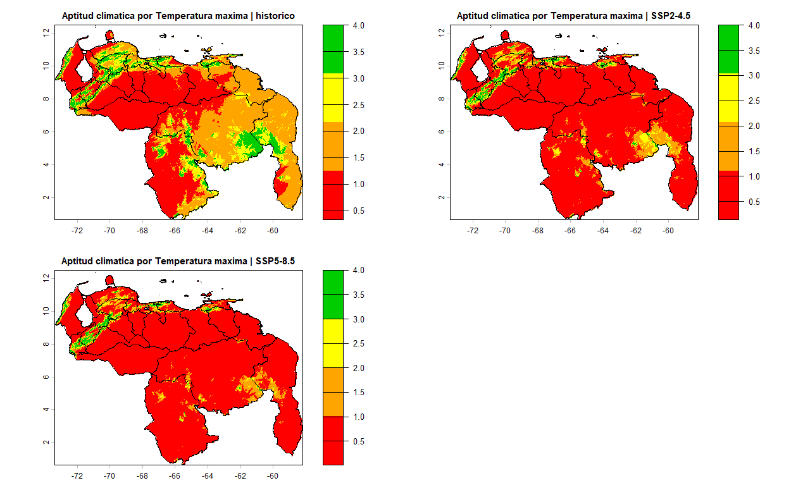
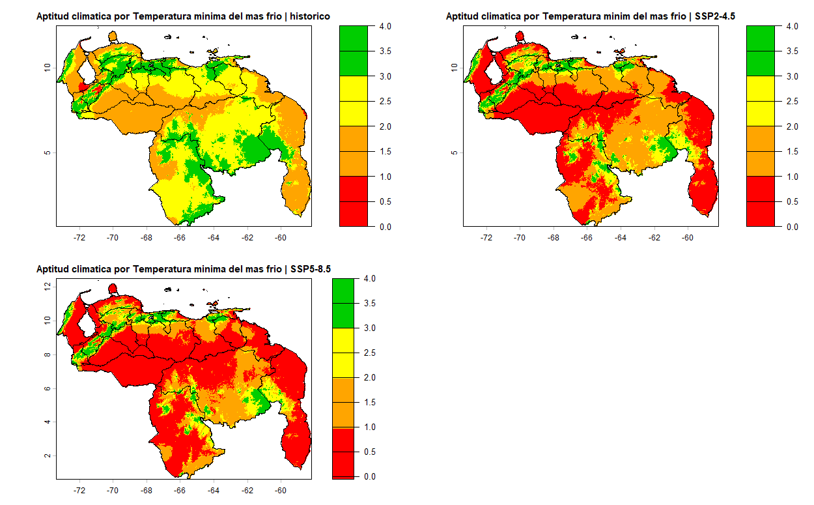
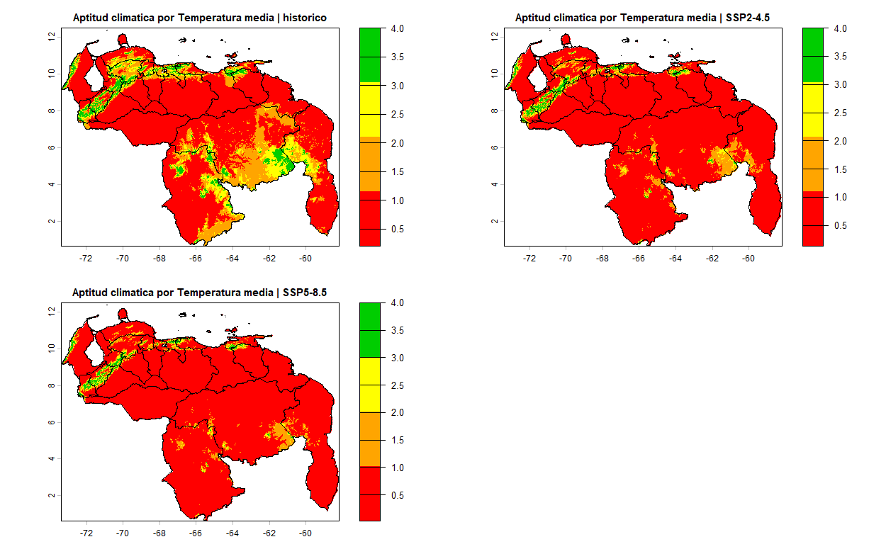
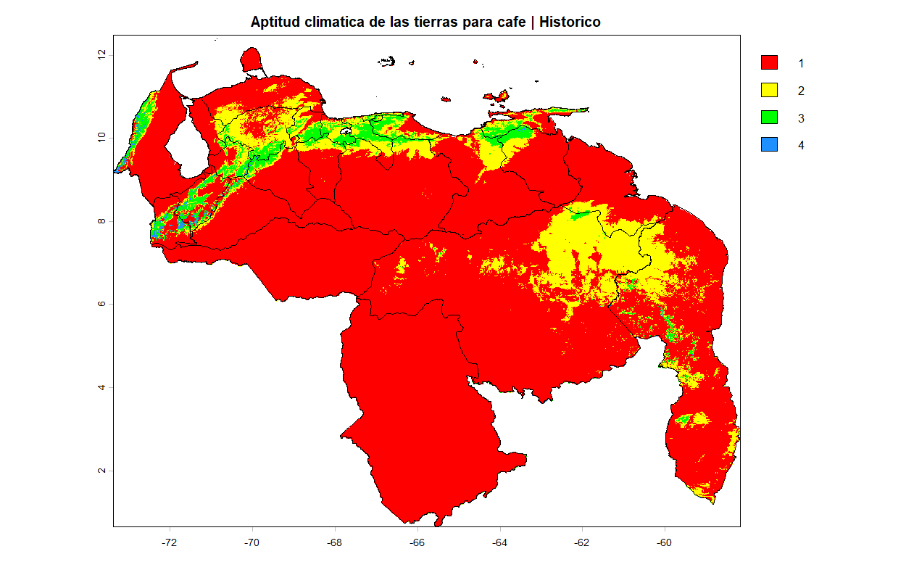
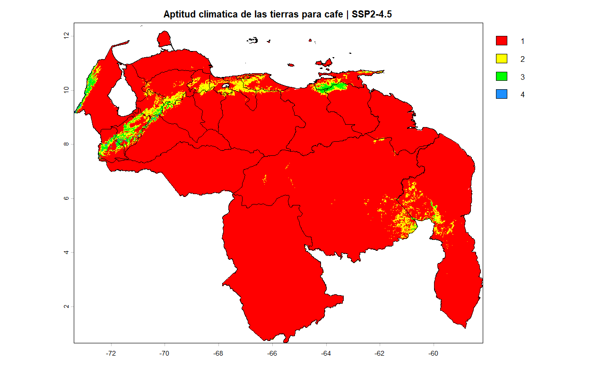
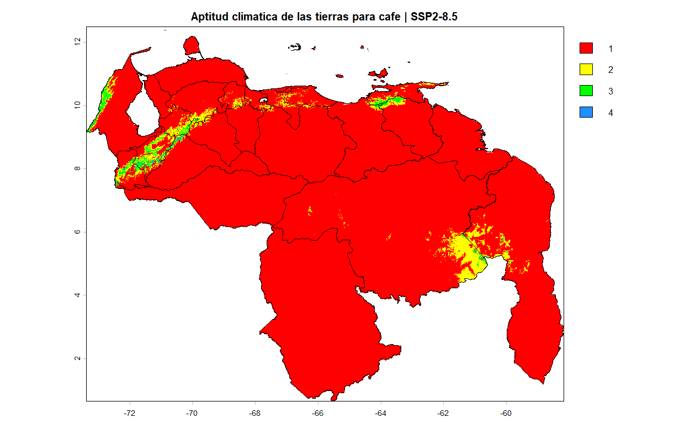
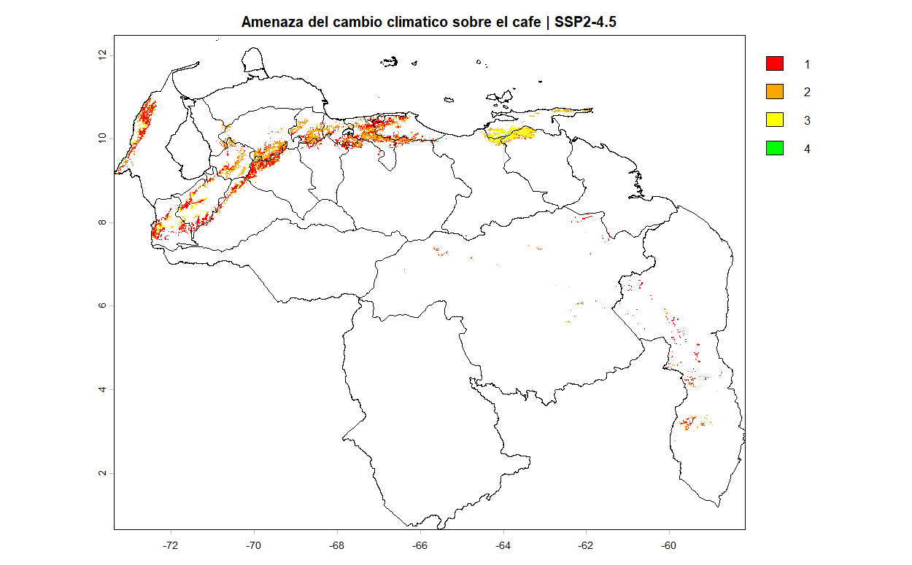
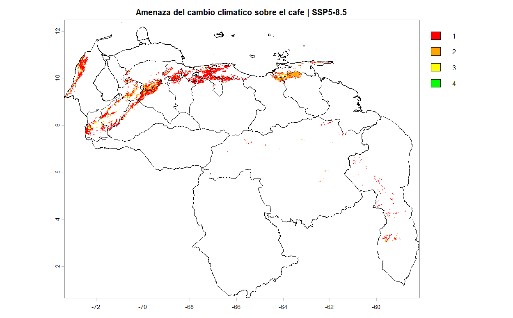

# Cafe

Descripcion brebe de lo que se trate este tipo de utilizacion de la tierra del maiz, como: fecha de siembra, duracin del ciclo, si usa riego o no, etc

## Region de exposicion:

```{r}
#| include: false
knitr::opts_chunk$set(echo = TRUE)
library("terra")
library("sf")
venezuela <- st_read("C:/Sevilla/UCV/Oscar/FAO_Cambiocliamtico2026/Coberturas/Contorno_Venezuela/AOI_linea_referencia1.shp")
```

```{r}
#| label: mapa-cafe-estandar
#| warning: false
#| message: false
#| echo: false
#| fig-align: center
re_cafe_estandar<- rast("C:/Sevilla/UCV/Oscar/FAO_Cambiocliamtico2026/Coberturas/area_trabajo/reg_cafe_estandar.tif")

plot(re_cafe_estandar,main = "Region de exposicion para cafe segun criterios estandar",col = "darkgreen", legend=FALSE, cex.main=0.78)
plot(st_geometry(venezuela),add=TRUE, border="black", lwd=1.5)

area_total_cafe<- expanse(re_cafe_estandar, unit = "ha")
a_cafe<- format(round(area_total_cafe / 100, digits = 1), scientific = FALSE, big.mark = ".", decimal.mark = ",")
```

En Venezuela la superficie total de Region de Exposicion para el **Cafe** es de" **`r a_cafe$area`** Km^2^.

## Factores de Exposicion

#### 1. Precipitacion media anual:


#### 2. Periodo de humedad (Dias secos) al año:


#### 3. Temperatura maxima anual:


#### 4. Temperatura minima del mes mas frio:


#### 5. Tempertura media anual:


## Aptitud cliamtica de las tierras

#### Escenario Historico o Base:


#### Escenario SSP2-4.5:



#### Escenario SSP5-8.5:



## Amenaza

#### Cambio con respecto al Escenario SSP2-4.5:



#### Cambio con respecto al Escenario SSP5-8.5:



