# Cacao

## Region de exposicion:

```{r}
#| include: false
knitr::opts_chunk$set(echo = TRUE)
library("terra")
library("sf")
venezuela <- st_read("C:/Sevilla/UCV/Oscar/FAO_Cambiocliamtico2026/Coberturas/Contorno_Venezuela/AOI_linea_referencia1.shp")
```

```{r}
#| label: mapa-cacao-estandar
#| warning: false
#| message: false
#| echo: false
#| fig-align: center
re_cacao_estandar<- rast("C:/Sevilla/UCV/Oscar/FAO_Cambiocliamtico2026/Coberturas/area_trabajo/reg_cacao_estandar.tif")

plot(re_cacao_estandar,main = "Region de exposicion para cafe segun criterios estandar",col = "darkgreen", legend=FALSE, cex.main=0.78)
plot(st_geometry(venezuela),add=TRUE, border="black", lwd=1.5)

area_total_cacao<- expanse(re_cacao_estandar, unit = "ha")
a_cacao<- format(round(area_total_cacao / 100, digits = 1), scientific = FALSE, big.mark = ".", decimal.mark = ",")
```

En Venezuela la superficie total de Region de Exposicion para la **Cacao** es de" **`r a_cacao$area`** Km^2^.

## Factores de Exposición

#### 1. Precipitación anual:

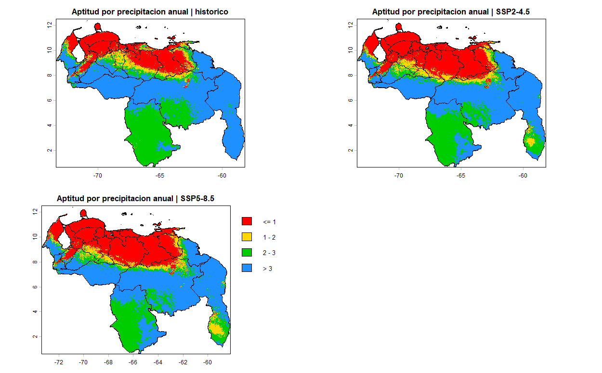

#### 2. Duracion de estacion seca:
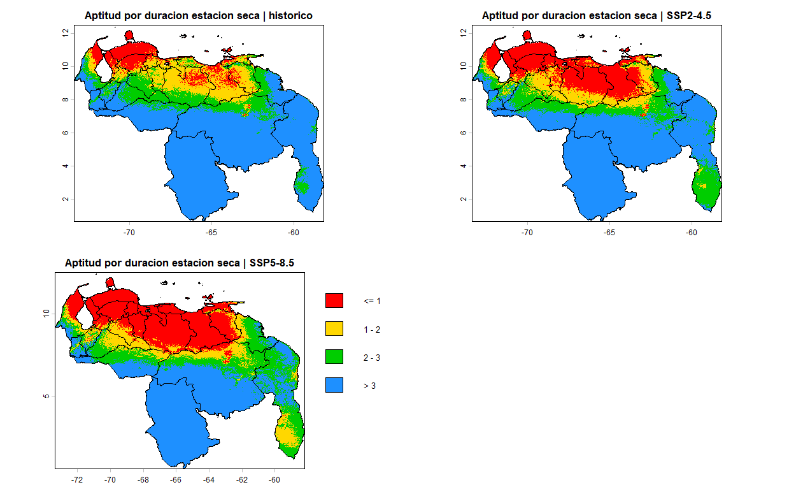

#### 3. Temperatura media anual:
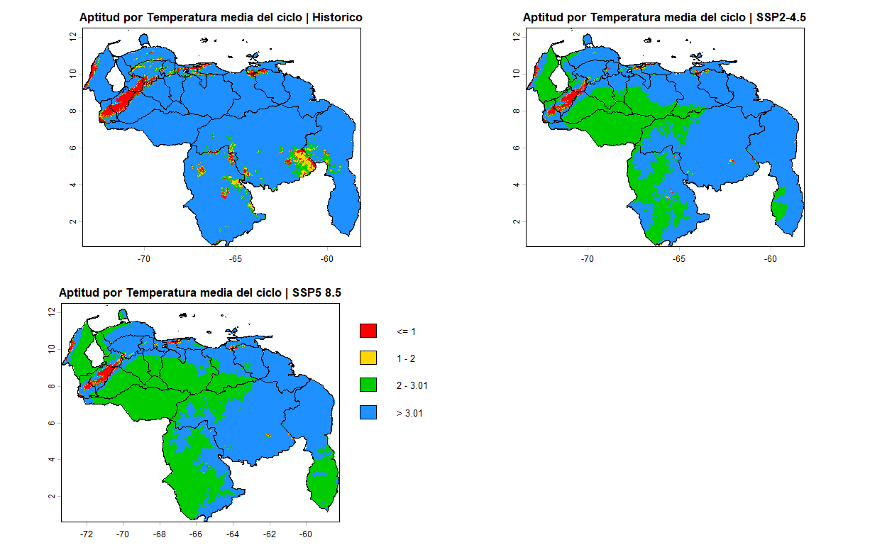

#### 4. Temperatura maxima anual:
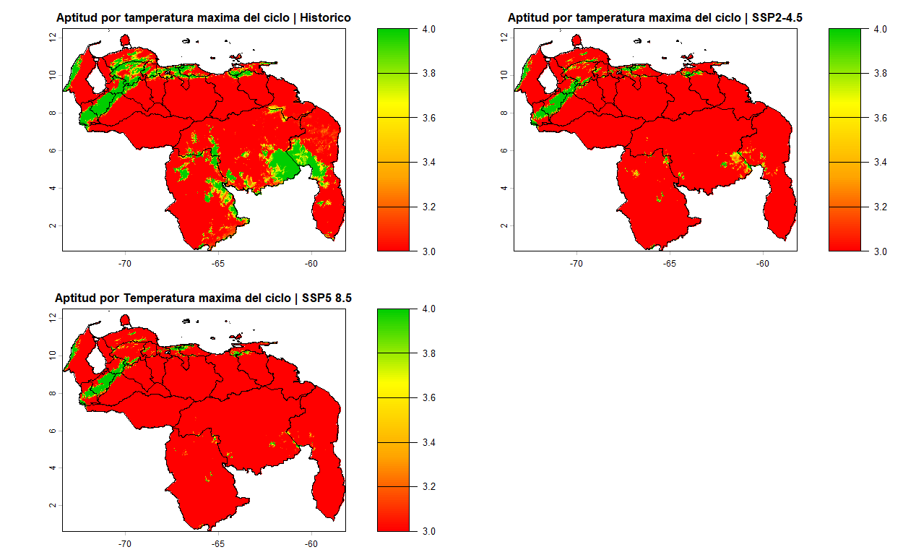

#### 5. Temperatura minima anual:
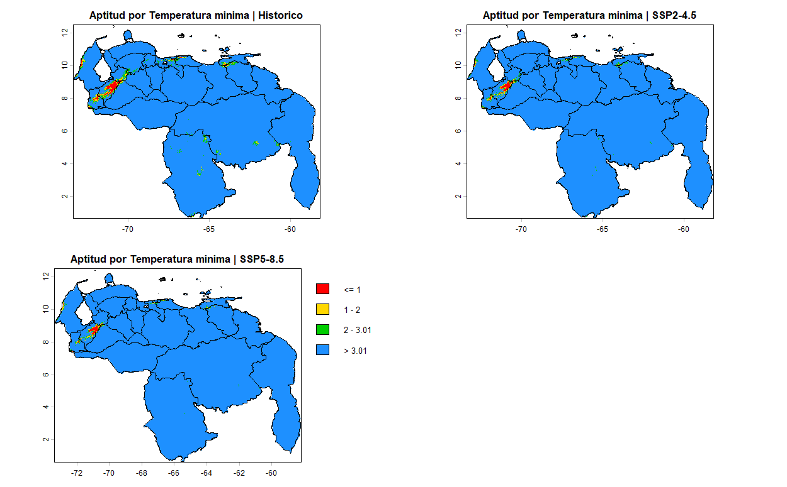

#### 6. Humedad relativa del mes mas seco:
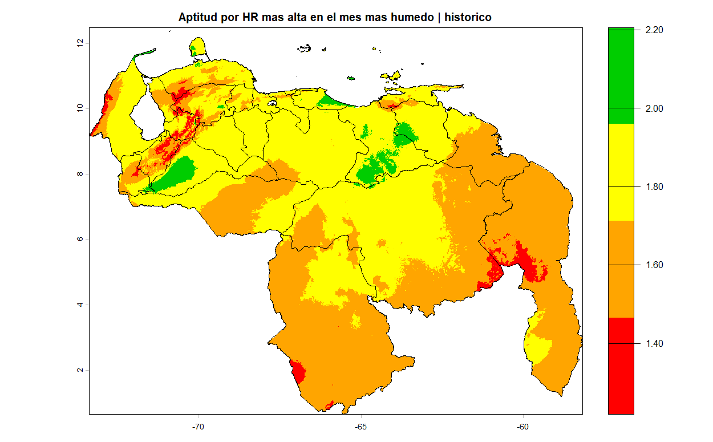

#### Mes con mayor humedad relativa al año
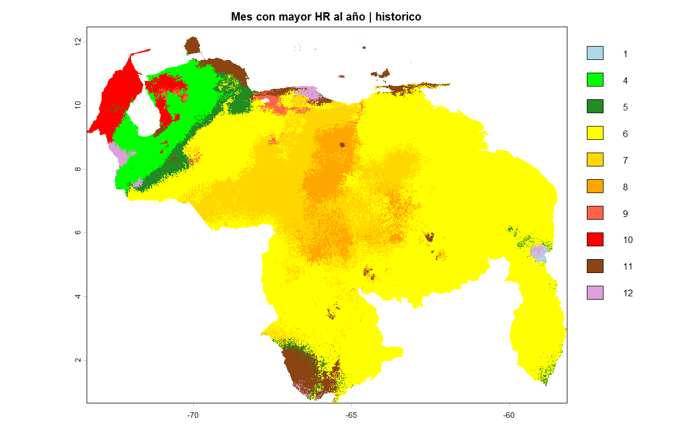

## Aptitud climática de las tierras

#### Escenario Histórico o Base:

##### Sin Riego
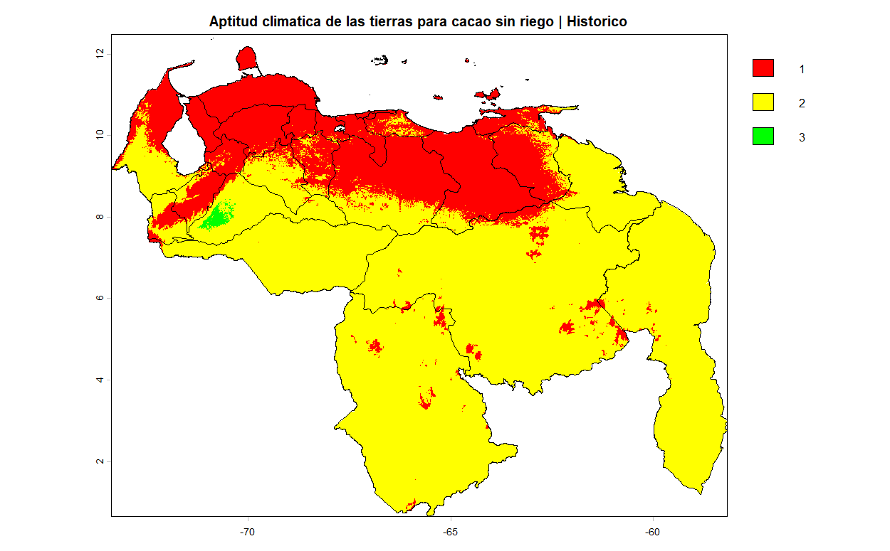

##### Con riego


#### Escenario SSP2-4.5:

##### Sin riego
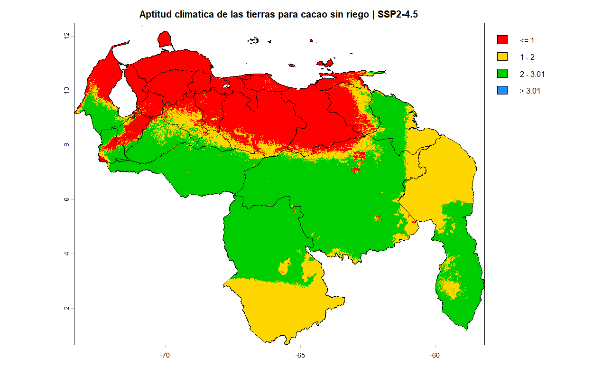

##### Con riego
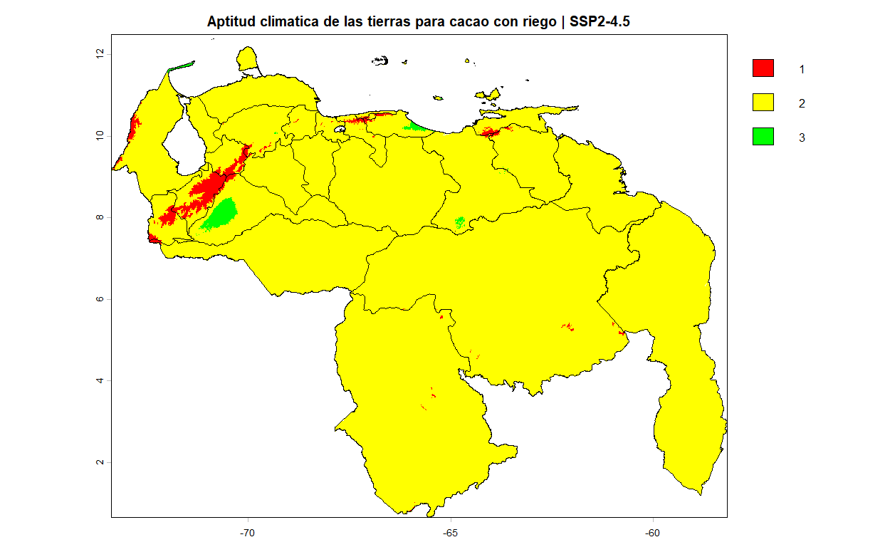

#### Escenario SSP5-8.5:

##### Sin riego
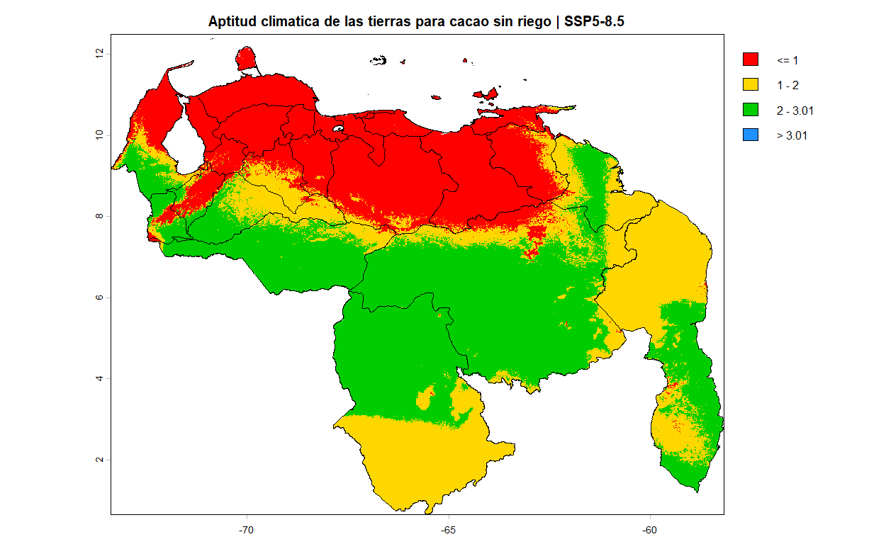
##### Con riego
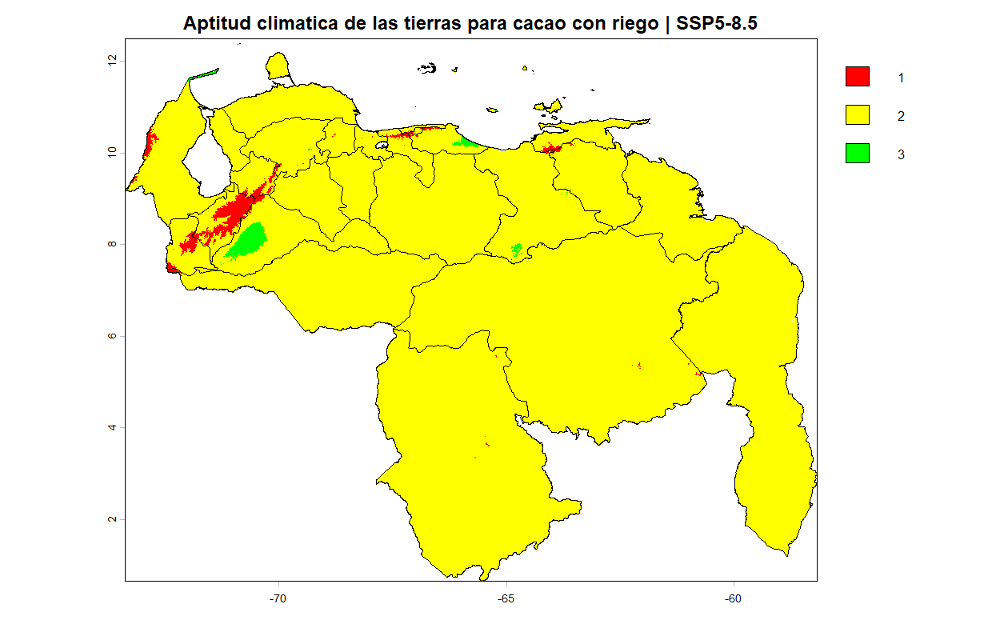

## Amenaza

#### Cambio con respecto al Escenario SSP2-4.5:

##### Sin riego
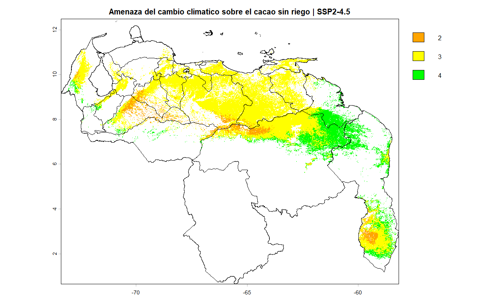

##### Con riego
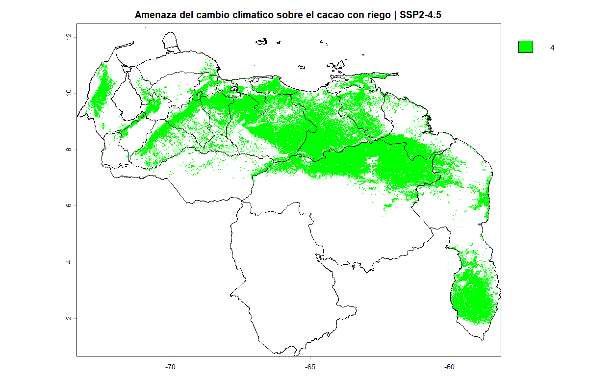

#### Cambio con respecto al Escenario SSP5-8.5:

##### Sin riego
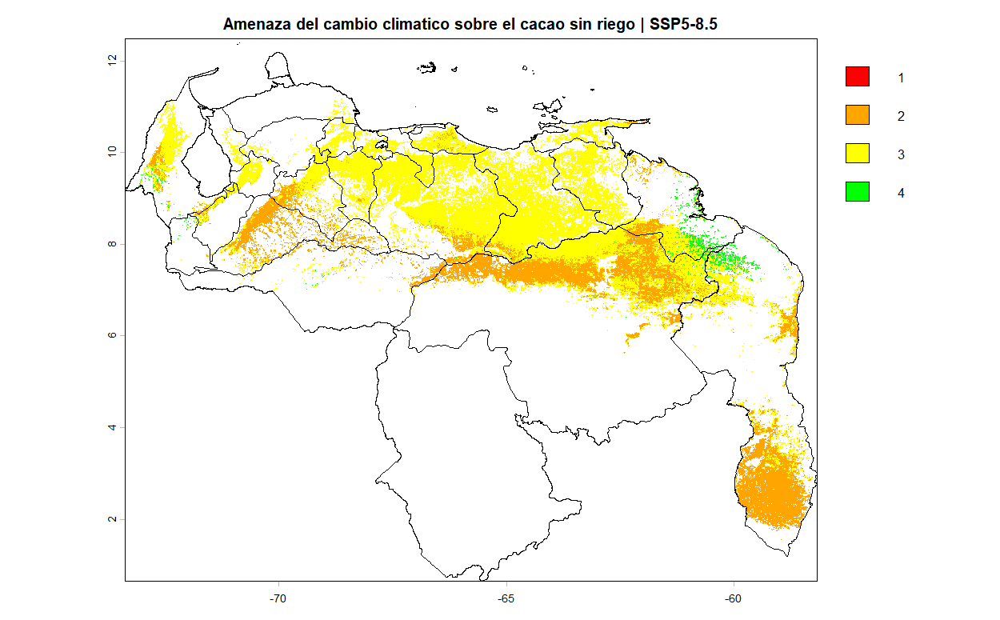

##### Con riego

