# Maiz

Descripcion brebe de lo que se trate este tipo de utilizacion de la tierra del maiz, como: fecha de siembra, duracin del ciclo, si usa riego o no, etc

## Region de exposicion:

```{r}
#| include: false
knitr::opts_chunk$set(echo = TRUE)
library("terra")
library("sf")
venezuela <- st_read("C:/Sevilla/UCV/Oscar/FAO_Cambiocliamtico2026/Coberturas/Contorno_Venezuela/AOI_linea_referencia1.shp")
```

```{r}
#| label: mapa-maiz-estandar
#| warning: false
#| message: false
#| echo: false
#| fig-align: center
re_maiz_estandar<- rast("C:/Sevilla/UCV/Oscar/FAO_Cambiocliamtico2026/Coberturas/area_trabajo/reg_maiz_estandar.tif")

plot(re_maiz_estandar,main = "Region de exposicion para maiz segun criterios estandar",col = "darkgreen", legend=FALSE, cex.main=0.78)
plot(st_geometry(venezuela),add=TRUE, border="black", lwd=1.5)

area_total_maiz<- expanse(re_maiz_estandar, unit = "ha")
a_maiz<- format(round(area_total_maiz / 100, digits = 1), scientific = FALSE, big.mark = ".", decimal.mark = ",")
```

En Venezuela la superficie total de Region de Exposicion para el **Maiz** es de" **`r a_maiz$area`** Km^2^.

## Factores de Exposicion

#### 1. Precipitacion del ciclo de cultivo:

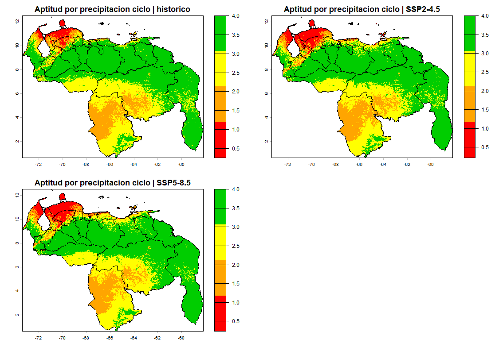

#### 2. Precipitacion del mes de mayo:

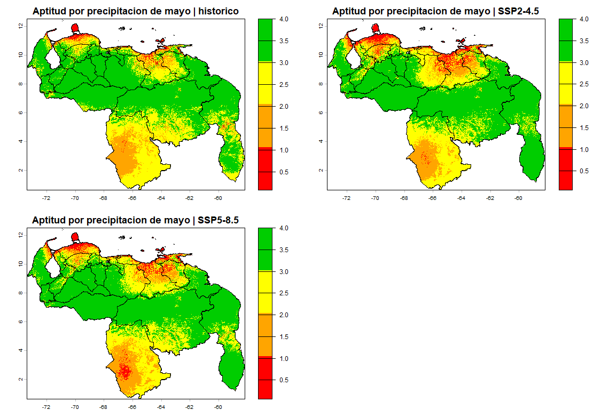

#### 3. Precipitacion del mes de junio:
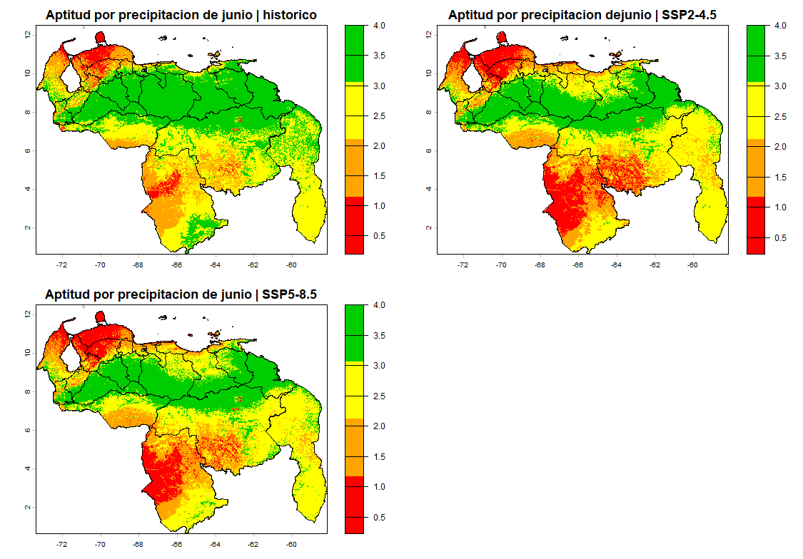

#### 4. Precipitacion del mes de julio:
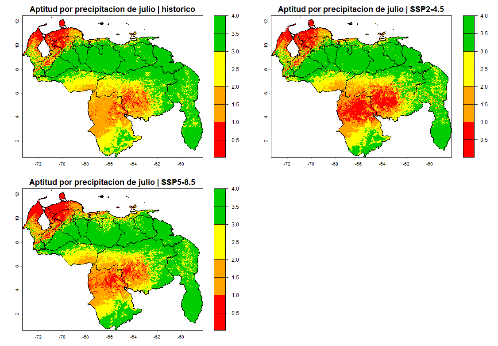

#### 5. Precipitacion del mes de agosto:
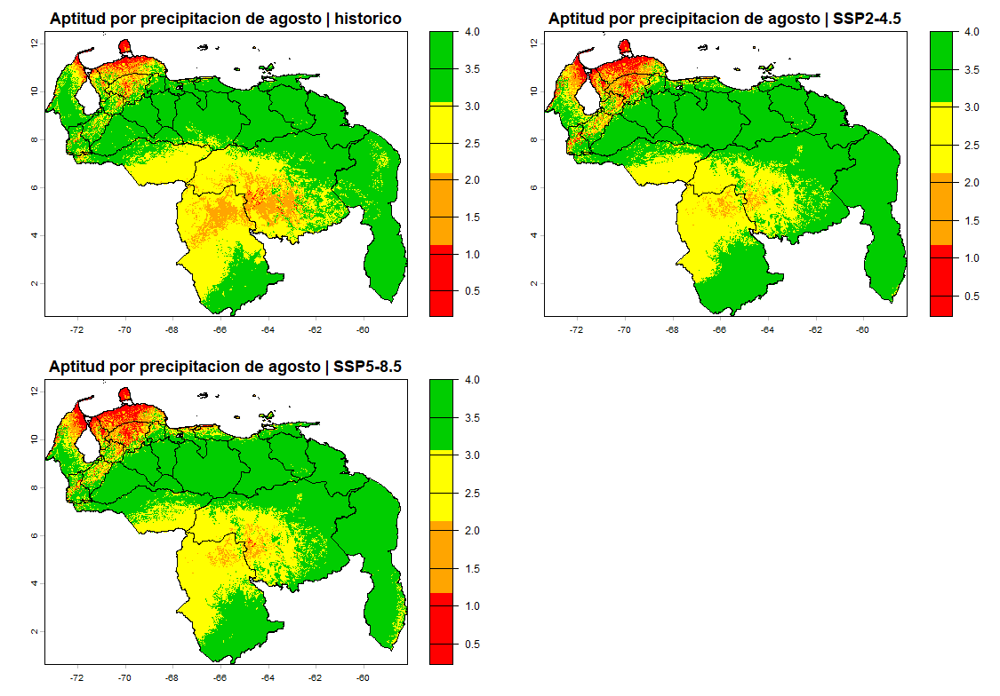

#### 6. Temperatura media del ciclo de cultivo:
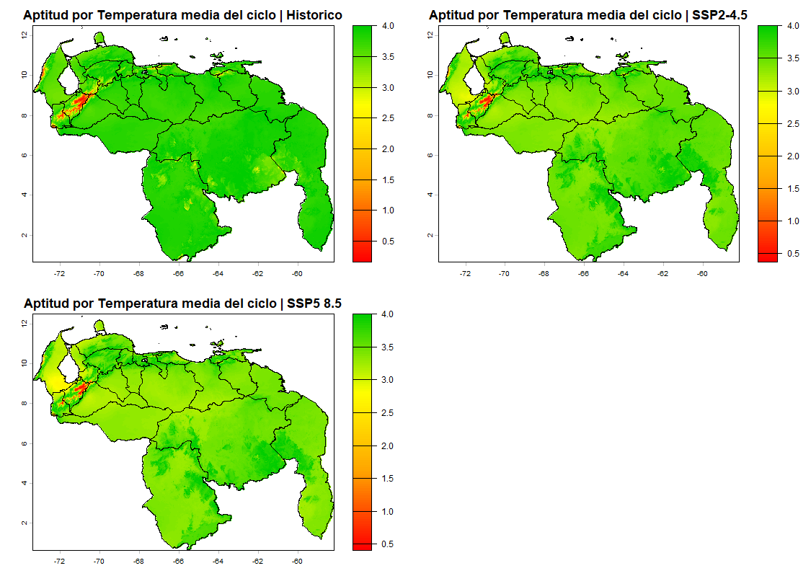

#### 7. Temperatura minima del ciclo de cultivo:
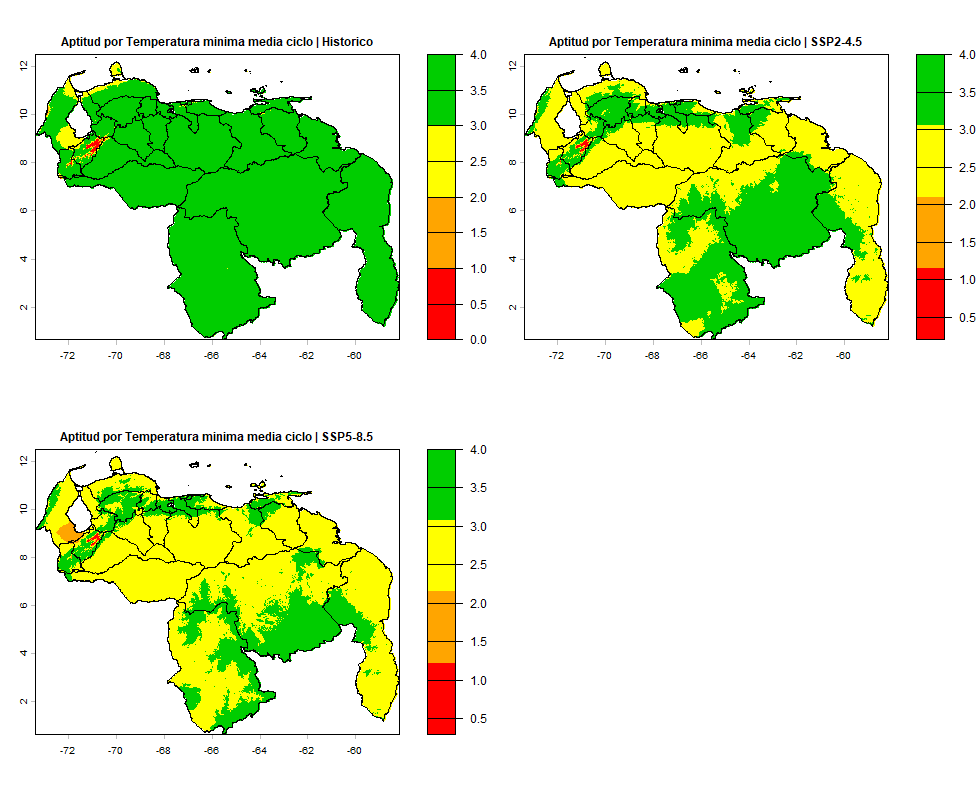

## Aptitud climatica de las tierras

#### Escenario Historico o Base:

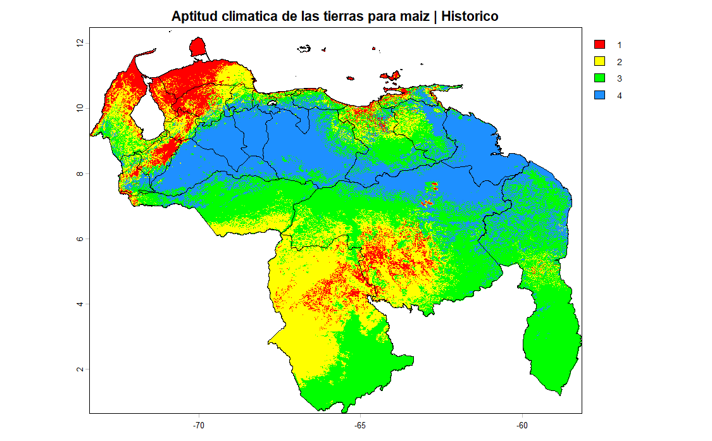

#### Escenario SSP2-4.5:

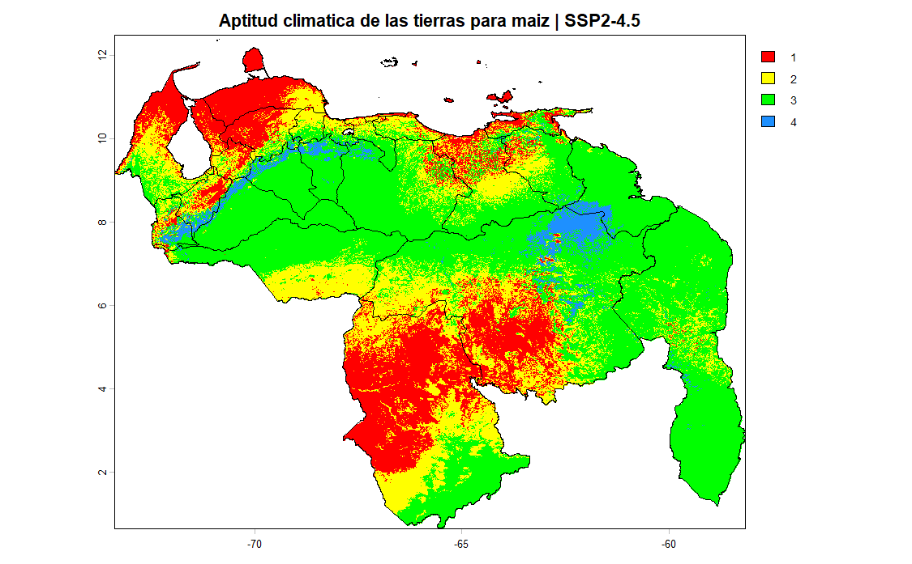

#### Escenario SSP5-8.5:

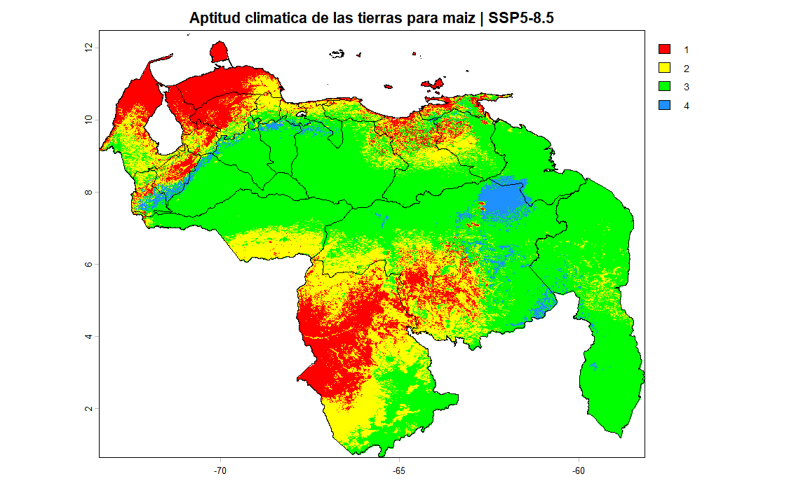

## Amenaza

#### Cambio con respecto al Escenario SSP2-4.5:

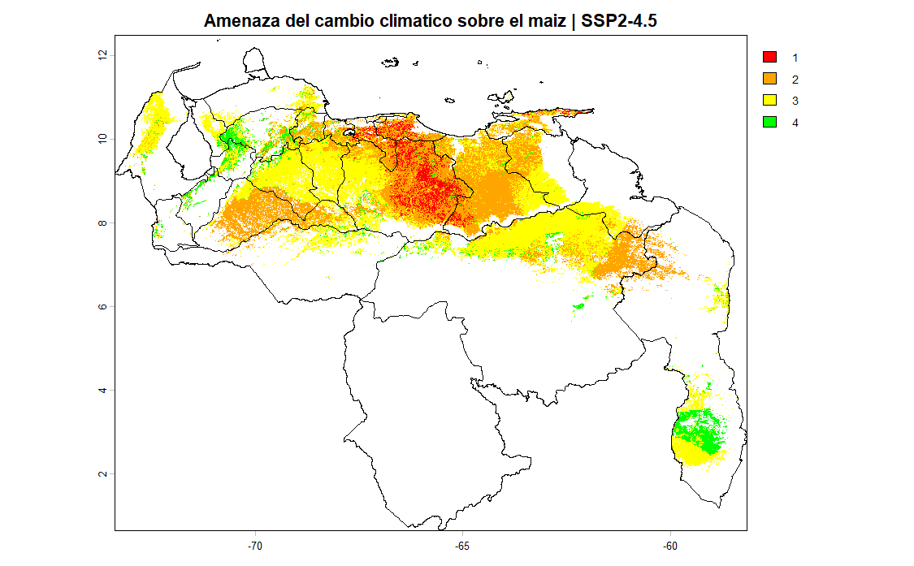

#### Cambio con respecto al Escenario SSP5-8.5:

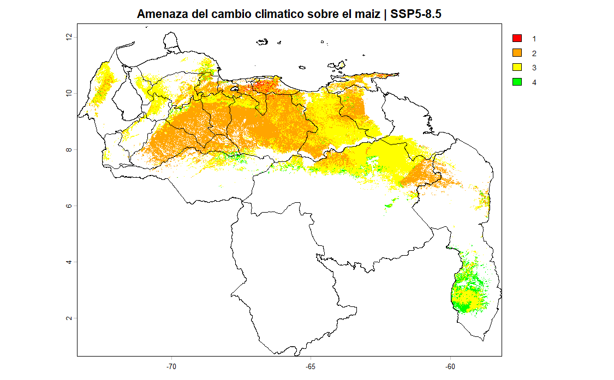

<!--## Impacto

#### Escenario SSP2-4.5:

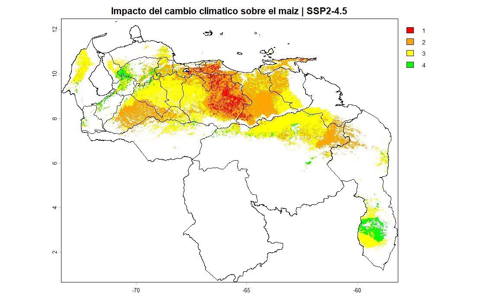

#### Escenario SSP5-8.5:

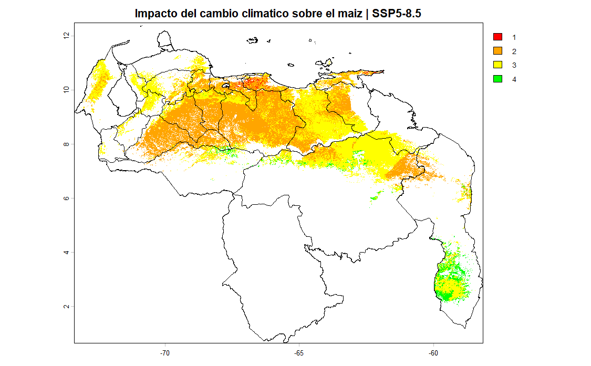


-->

